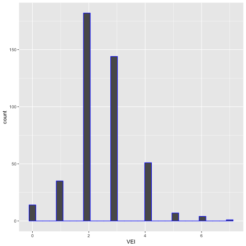

Volcanic Activity
========================================================
author: Hiren Patel
date: December 07, 2017
autosize: true
transition: concave

App Description
========================================================


<https://www.thinglink.com/scene/777592745177907201>

***
A visualization of Volcanic activity troughout the world
reveals interesting patterns of activity. With the help 
of a "Shiny"" application, areas of volcanic activity reveal
"hot-spots" over time.

- Visualize broad ares for comparision.
- Provides location and year of occurance.

Data Source
========================================================

- From National Geophysical Data Center's Earthquake Database.
    National Geophysical Data Center / World Data Service (NGDC/WDS): 
    Significant Volcanic Eruptions Database. 
    National Geophysical Data Center, NOAA. doi:10.7289/V5JW8BSH
- See Links for details on Data Source and GitHub [Links](#/Links).

```r
# See original dataset dimensions
VolDat <- read.csv("Volcano.csv", header = TRUE)
dim(VolDat)
[1] 592   7
```

Summary of Volcainic Events
========================================================

***
- Great deal of variability between years
- Average Elevation is 2039.3828671
- Average Volcanic Explosivity Index (VEI) is 3.5

Links
========================================================

- GitHub Repo: <https://github.com/dushany/DDP_Assignment_Wk4> 
- Shiny App: <https://dushany.shinyapps.io/Earthquakes/>
- NOAA : <https://www.ngdc.noaa.gov/nndc/servlet/ShowDatasets?dataset=102557&search_look=50&display_look=50>

